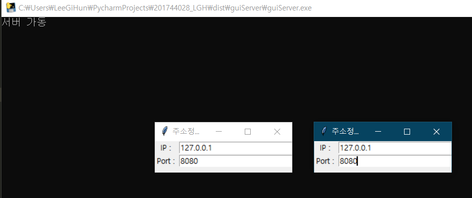
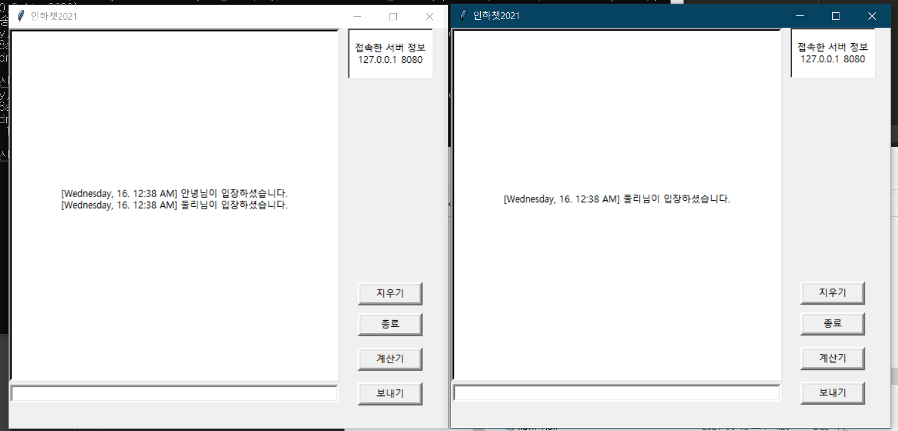
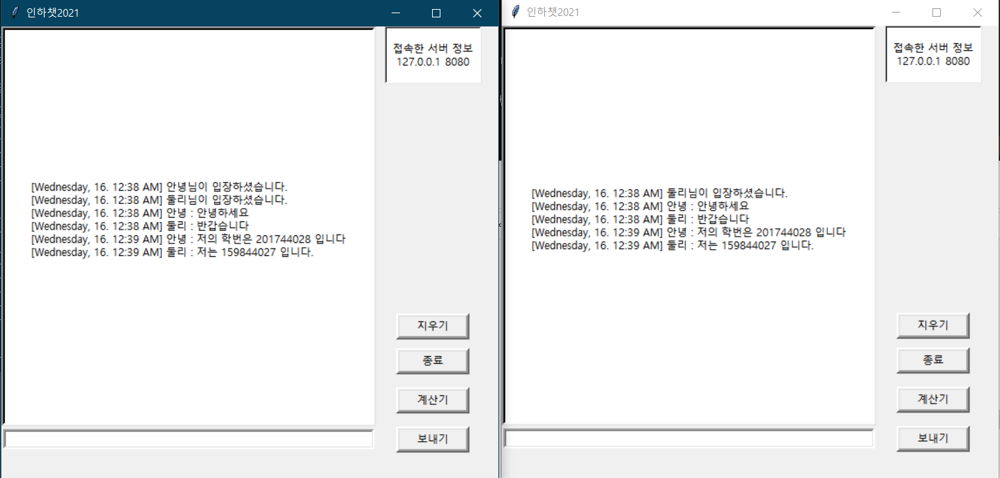
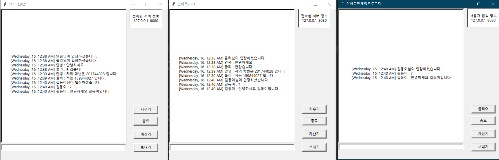
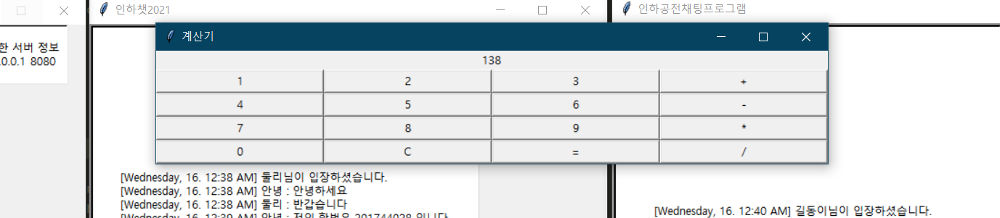
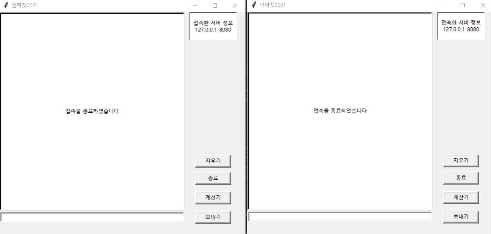
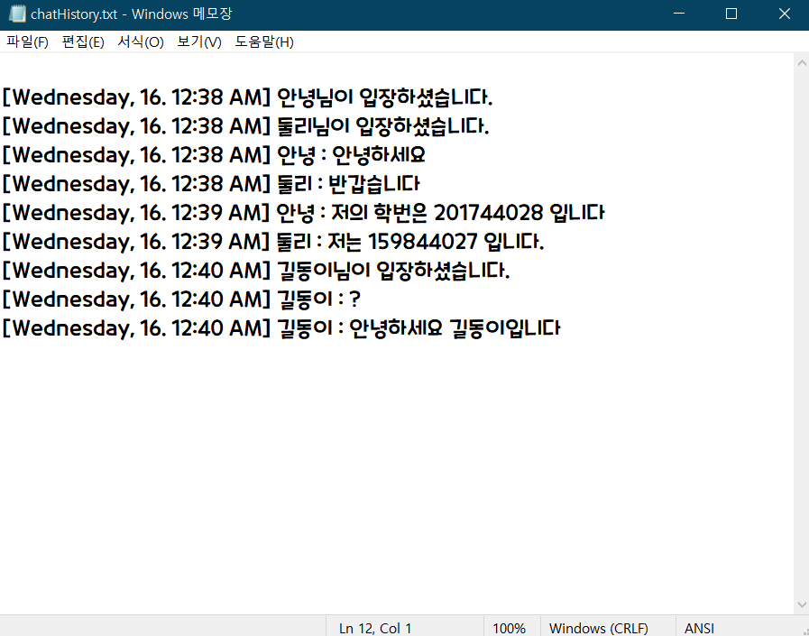

# TCP_Chat_Project
201744028_A반_이기훈

TCP/IP 기말고사를 위한 repository

(클라이언트 두 명 접속 시도 / 주소 입력 후 엔터버튼 누르면 채팅방 오픈)
</img>

(클라이언트 2명 입장)
</img>

(동시 채팅)
</img>

(클라이언트3 까지 합류)
</img>

(계산기 기능)
</img>

(종료버튼을 눌렀을 시)
</img>

(대화내용이 기록된 모습)
</img>
